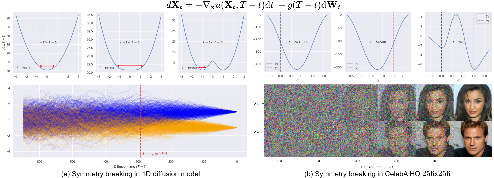
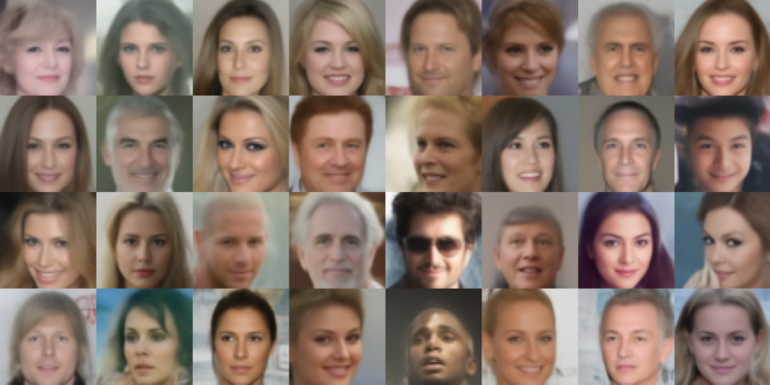
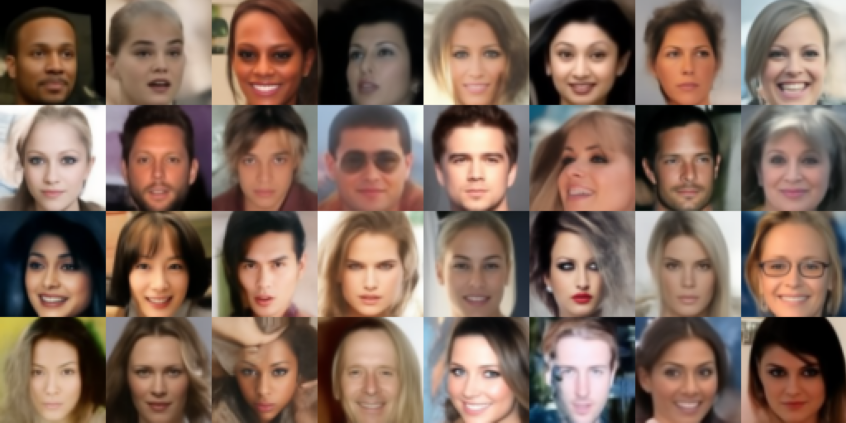
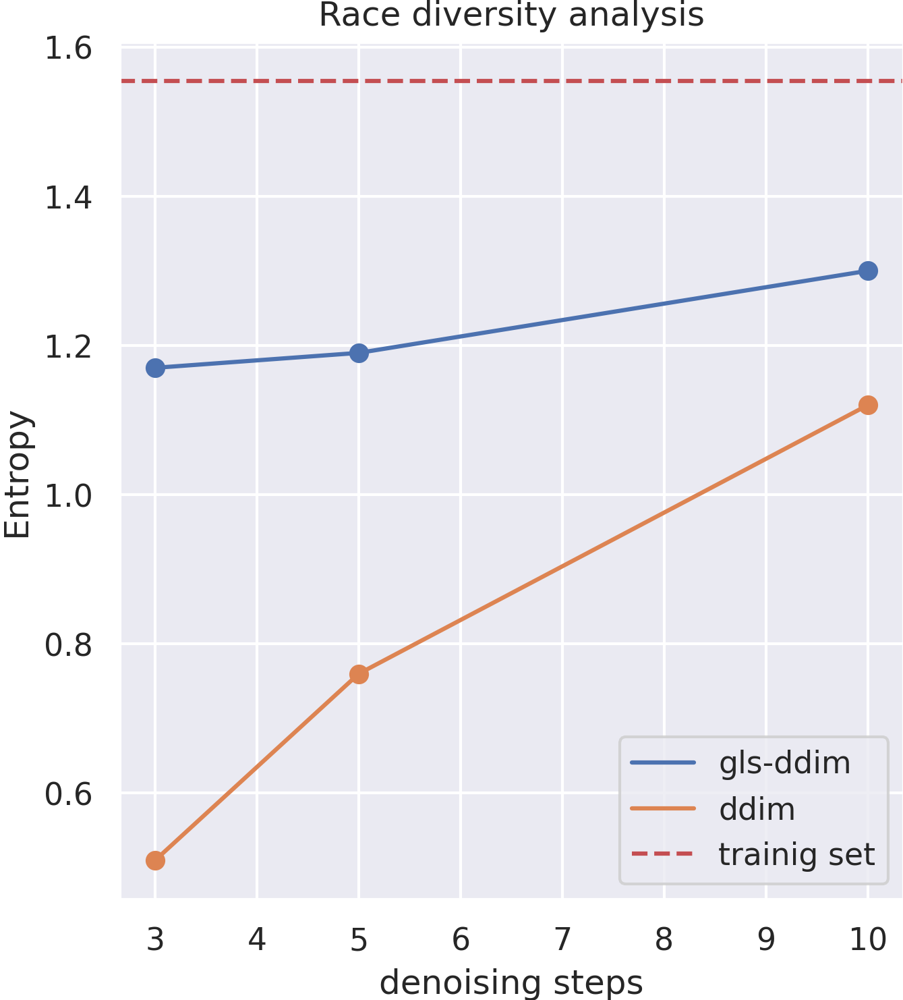

# Spontaneous Symmetry Breaking in Generative Diffusion Models

This repository is the official implementation of the NeurIPS 2023 paper [Spontaneous Symmetry Breaking in Generative Diffusion Models](https://arxiv.org/abs/2305.19693).  For a detailed video explanation, see our [video paper presentation](https://www.youtube.com/watch?v=IG0NNE9bpWU).


---

<p align="justify">
We show that the dynamics of diffusion models exhibit a "spontaneous symmetry breaking" phenomenon, dividing the generative dynamics
in two distinct phases: 1) A linear steady-state dynamics around a central fixed-point and 2) an attractor dynamics directed
towards the data manifold. These two "phases" are separated by the change in stability of the central fixed-point, with the
resulting window of instability being responsible for the diversity of the generated samples. In an intuitive sense, the dynamics of a generated sample passes from a phase of equal potentiality,
where any (synthetic) datum could be generated, to a denoising phase where the (randomly) "selected" datum is fully denoised.
An overview of spontaneous symmetry breaking in diffusion models is illustrated in the figure below:
</p> 

<p float="center">
  
</p>

<p align="justify">
This phenomenon is clearly observable in the one-dimensional case. A symmetry-breaking event, marked by a significant change in the potential well's shape, occurs upon reaching a critical value. This triggers a split in the potential well, signifying a shift in the dynamics and effectively illustrating these two generative phases.
</p>
<p align="center">
  
</p>
<p align="justify">
Our findings challenge the current dominant conception that the generative process of diffusion models is
essentially comprised of a single denoising phase. In particular, we show that
an accurate simulation of the early dynamics does not significantly contribute to the final generation, since early fluctuations
are reverted to the central fixed point. To leverage this insight, we propose a Gaussian late initialization scheme, which 
significantly improves model performance, achieving up to 3x FID improvements on fast samplers, while also increasing sample
diversity, e.g. racial composition of generated CelebA images (samples below for 5 denoising steps), as illustrated below: 
</p> 

<p float="center">
  
  
  
</p>

Our work offers a new way to understand the generative dynamics of diffusion models that has the potential to bring 
about higher performance and less biased fast-samplers.

## Demostrations and tutorials

To facilitate your understanding of the phenomenon of spontaneous symmetry breaking in diffusion models, we have provided the following examples.

|                                                            Link                                                             | Description                                                                    |
|:---------------------------------------------------------------------------------------------------------------------------:|:-------------------------------------------------------------------------------|
|         [](./notebooks/1d_example.ipynb)          | Symmetry Breaking in 1D diffusion model                                        |
| [](https://colab.research.google.com/drive/1ONQgBFye2MF9YSHszNvYApzqKYmh_JpA?usp=sharing) | Load our pretrained checkpoints and play with our Gaussian late initialization |
 


## Requirements

### Dependencies 

To install requirements:

```setup
pip install -r requirements.txt
```

You can directly train and evaluate the model on your particular data following the commands below. However, 
for merely reproducing the results on the paper using the pretrained models, please refer to the section [Pre-trained Models](#pre-trained-models)

### Training
To train the diffusion model on e.g., CIFAR10, run this command:

```train
python main.py --workdir="./results/ddpm_cifar10" --config="configs/ddpm/cifar10.py" --mode="train"
```

>📋  To train the model on other dataset, just replace the config file and the corresponding workdir
> For MNIST for example `python main.py --workdir="./results/ddpm_mnist" --config="configs/ddpm/mnist.py" --mode="train"`
> For CelebA 64x64 : `python main.py --workdir="./results/ddpm_celeba64" --config="configs/ddpm/celeba64.py" --mode="train"`

This will train a model using the configuration found in `configs/ddpm/XXXXX.py`. During training, the validation batch size is 
the same as the training batch size.

### Evaluation

#### Get Stats Files

To evaluate the trained model we first need to obtain the stats files, you can download the files [here]()
or by running the following command:

```eval
 python main.py --config="configs/ddpm/cifar10.py" --mode="fid_stats"
```

### FID scores

```eval
 python main.py --config="configs/ddpm/cifar10.py" --mode="fid_stats"
```


## Pre-trained Models
You can immediately use our pre-trained models by downloading the corresponding files using the links below:


| Checkpoint path                                                                                                              | FID  | 
|:-----------------------------------------------------------------------------------------------------------------------------|:----:|
| [`results/checkpoints/ddpm_cifar10/`](https://drive.google.com/file/d/102EdTmv3WQIuUAOItr00HF0ax1oz3Xa7/view?usp=drive_link) | 3.08 | 
| [`results/checkpoints/ddpm_celeba64/`](https://drive.google.com/file/d/1-y-lZ4ujmtbebKEpoRtZllEripKuvnbR/view?usp=sharing)   | 3.2  | 


Make sure to download the following files for evaluation

| File        | location                                    | Description                                                                      |
|-------------|---------------------------------------------|----------------------------------------------------------------------------------|
| Stats files | `assets/stats`                              | Files contating the statistics (mean, and covariance) for evaluating FID scores. |
| Checkpoints | `results/checkpoints/ddpm_xxxx/checkpoints` | Trained diffusion model checkpoint.                                              |

where `xxxx` is the name of the dataset.


## Results


### Boosting performance of fast samplers 

| Dataset         | n   | **gls-DDPM** | DDPM   | gls-DDIM | DDIM   | gls-PNDM | PNDM   |
|-----------------|-----|----------|--------|----------|--------|----------|--------|
| **MNIST**       | 10  | **4.21**     | 6.75   | **2.44**     | 4.46   | **5.02**     | 14.36  |
|                 | 5   | **6.95**     | 13.25  | **6.95**     | 13.25  | **5.11**     | 21.22  |
|                 | 3   | **11.92**    | 42.63  | **11.92**    | 42.63  | **38.23**    | 154.89 |
| **CIFAR10**     | 10  | **28.77**    | 43.35  | **15.98**    | 19.79  | **5.90**     | 8.35   |
|                 | 5   | **42.46**    | 84.82  | **26.36**    | 44.61  | **9.55**     | 13.77  |
|                 | 3   | **57.03**    | 146.95 | **42.31**    | 109.37 | **34.20**    | 103.11 |
| **CelebA32**    | 10  | **11.05**    | 26.79  | **7.27**     | 11.37  | **2.88**     | 4.92   |
|                 | 5   | **14.79**    | 40.92  | **10.83**    | 23.45  | **4.2**      | 6.61   |
|                 | 3   | **18.93**    | 59.75  | **16.24**    | 45.34  | **28.60**    | 235.87 |
| **Imagenet64**  | 10  | **57.31**    | 65.68  | **36.25**    | 38.21  | **27.9**     | 28.27  |
|                 | 5   | **75.11**    | 99.99  | **52.11**    | 68.21  | **33.35**    | 34.86  |
|                 | 3   | **91.69**    | 145.71 | **76.92**    | 126.3  | **50.92**    | 70.58  |
| **CelebA64**    | 10  | **23.79**    | 36.66  | **15.82**    | 19.37  | **6.80**     | 8.03   |
|                 | 5   | **31.24**    | 48.38  | **22.06**    | 28.51  | **9.26**     | 10.26  |
|                 | 3   | **37.05**    | 62.18  | **29.96**    | 50.304 | **51.72**    | 171.75 |
<div style="text-align: justify">
Table 1: Summary of findings regarding image generation quality, as measured by FID scores.
The performance of the stochastic DDPM sampler is compared to the deterministic DDIM and
PNDM samplers in the vanilla case, as well as our Gaussian late start initialization scheme
denoted as “gls”. Results are presented for 3, 5, and 10 denoising steps (denoted as “n”) across
diverse datasets.
</div>

### Miscellaneous

**Acknowledgement** - This code implementation is partly based on the DDPM implementation by  [Song et al. (2021)](https://github.com/yang-song/score_sde_pytorch).

**Contact** - Feel free to reach out by sending an email to <g.raya@jads.nl> or opening an issue. Your feedback on what's working well or any issues you encounter is valuable!.
We are also curious about how you would use this in your project, so do let us know!


## References

Please consider citing our paper if you find the code helpful for your research.

```bib
@article{
    raya2023spontaneous,  
    title={Spontaneous symmetry breaking in generative diffusion models},  
    author={Gabriel Raya and Luca Ambrogioni},  
    year={2023},  
    journal={arXiv preprint arxiv:2305.19693}  
}
```
